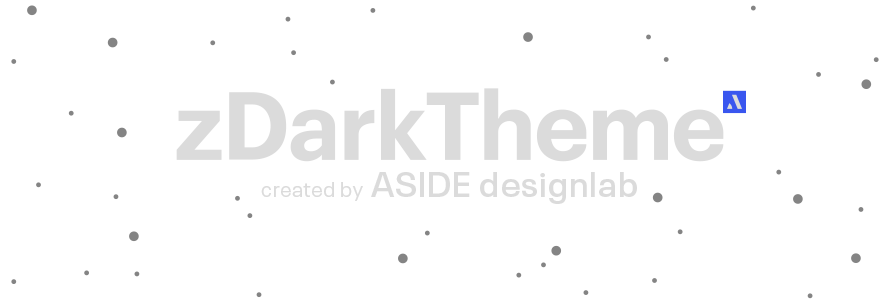
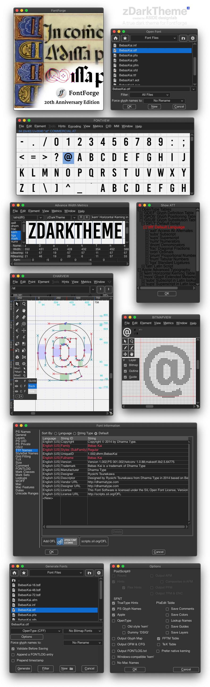

    

A true dark theme for [FontForge](http://fontforge.github.io/) carefully created by [ASIDE designlab (Adolfo Ovalles).](https://www.behance.net/ASIDEdesignlab)

## Features
* Colors and Icons inspired by dark mode Adobe apps.
* All icons Rebuild, including Debug dialog icons.
* Cleaned pixmaps folder with only tested icons and required files. 
* Pixel-perfect adjust for an optimal and clear view.
* Rebuilt version for old and repeated icons included in a separate folder for convenience.
* Extra icons to improve zDark Theme integration in future [FontForge](https://github.com/fontforge) releases.

## Installation
| :warning: | **Before anything, PLEASE BACK UP YOUR CURRENT PIXMAPS FOLDER. This way, you can always back to the previous state.**|
| :------ | :----------- |

1. Download the **`zDarkTheme.zip`** and unzip it.
2. Copy the **`pixmaps folder`** from **`zDarkTheme`**, and overwrite the appropriate FontForge's pixmaps folder:
  * **Win:** `C:\Program Files (x86)\FontForgeBuilds\share\fontforge\pixmaps`
  * **Mac:** `/Applications/FontForge.app/Contents/Resources/opt/local/share/fontforge/pixmaps/`
  * **UNIX:** `/usr/share/fontforge/pixmaps/`
3. In FontForge, go to `File > Preferences` and set `RessourceFile` to the `zDark.theme` file inside of the above folder.
4. Restart FontForge, and you're ready!

## Screenshost

    

## Pending Improvements
During the `zDarkTheme` creation process, I found few things that can improve its integration, but implement them requires a programing knowledge out of my basic skills. It only remains to wait for a future [FontForge](https://github.com/fontforge) update. For more details, check [IMPROVEMENTS](https://github.com/ASIDEdesignlab/zDarkTheme/blob/a7e767f8dfa4cc53b858297f50233da34aedee53/Support/IMPROVEMENTS.md)

>NOTE  
>Native macOS dark mode implementation is limited, but the below Terminal command will force launch the app in dark mode:  
>`/Applications/FontForge.app/Contents/MacOS/FontForge -NSRequiresAquaSystemAppearance NO`  
>[Read more about this.](https://forums.macrumors.com/threads/forcing-third-party-applications-to-use-dark-mode.2134382/)

## Contributing
I'm all ears to your suggestions and please, let me know if you help or found any issues. If you like it, I'll appreciate your comment. **Thanks, and spread the word!** :loudspeaker:

## License
Check [LICENSE](https://github.com/ASIDEdesignlab/zDarkTheme/blob/a7e767f8dfa4cc53b858297f50233da34aedee53/LICENSE) for more details on the licence.
