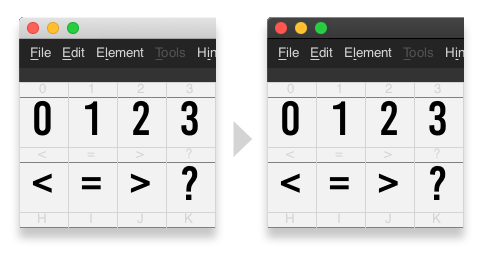
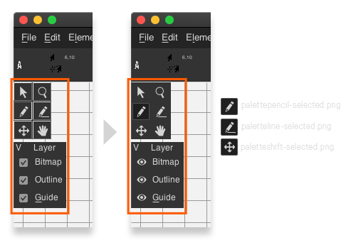
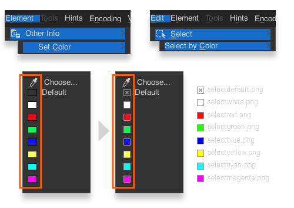
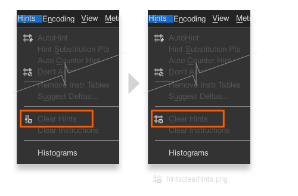
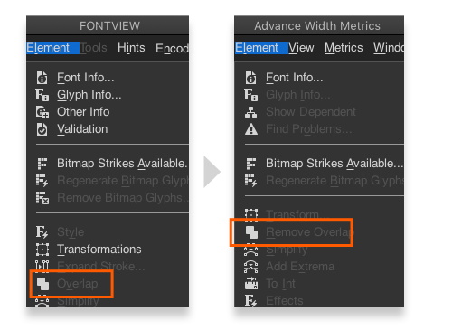
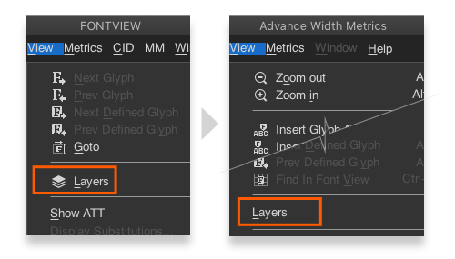
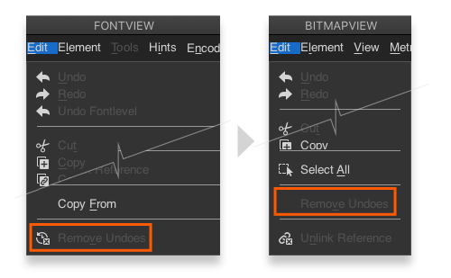
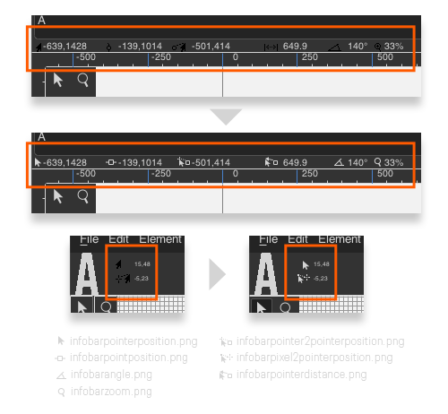
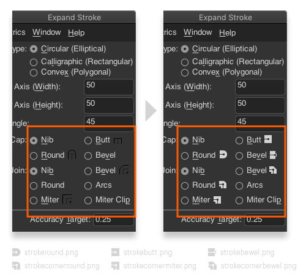

# zDarkTheme Improvements
During the `zDarkTheme` creation, I found few changes that can not just improve the integration of my theme. But also can help any other theme implementation in the future. These'll require time and effort, but I think it's well worth it.

### Use the latest macOS DSK for native dark mode support.
Making a new compilation with the latest macOS SDK may provide native suport for dark mode through the `NSRequiresAquaSystemAppearance` key. I'm using the [FontForge release 2020-11-07](https://fontforge.org/en-US/downloads/mac-dl/), on macOS Mojave 10.14.6 (18G9216). I tried the method [here](https://forums.macrumors.com/threads/forcing-third-party-applications-to-use-dark-mode.2134382/), but only the Terminal command allowed me to force dark mode.

### Unify tool palettes appearance and behavior.
The tool pallets on the BitmapView should have the same appearance and behavior as the ones on the CharView.

### Correct some icons usages and drop using duplicate icons.
Make and share use of the icon files for the menus options `Set Color` and `Select by Color`

Set a different icon file (hintsclearhints.png) for the menu option `Clear Hints`

Set the same icon file (overlaprm.png) to the menu option `Remove Overlap` in MetricsView (this option is currently using a duplicated icon file rmoverlap.png).

Below a list of files icnos that seem not used:

|    changeweight.png    |  fileclose2.png  |    paletteselectedbg.png    |
|:----------------------:|:----------------:|:---------------------------:|
| elementtilepath.png    | fliphor.png      | palettespirodisabled.png    |
| elementtilepattern.png | flipvert.png     | palettespiroup-selected.png |
| exclude.png            | inline.png       | rotate180.png               |
| extendcondense.png     | intersection.png | rotateccw.png               |
| fflogo.png             | oblique.png      | rotatecw.png                |
| fflogo13.png           | outline.png      | shadow.png                  |
| ffsplash1.png          | text12210.png    | skew.png                    |
| ffsplash2.png          | wireframe.png    | splash2019.png              |
| ffsplash3.png          |                  | rmoverlap.png*              |
> `rmoverlap.png` is in use, but is duplicated.

### Apply the same icon for the same options on all views.
Apply icon file viewlayers.png to `Layers` menu option on MetricsView.

Apply icon file editrmundoes.png to `Remove Undoes` on BitmapView.

### Enable new interface icon customization.

Apply new custom icons for the pointer and point indicators on the info bar in the CharView and the BitmapView.

Replace and add new custom icons for `Expand Stroke` dialog.

